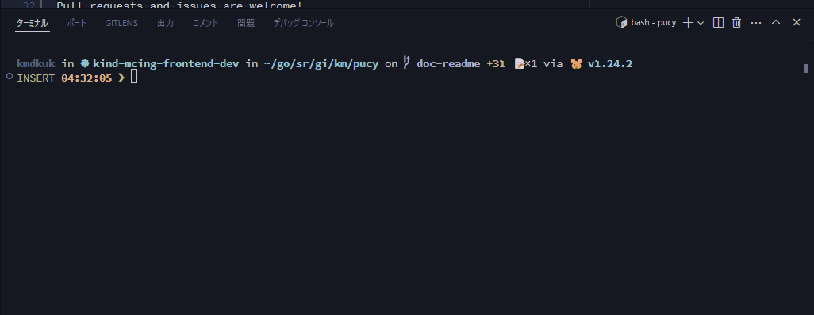

# pucy

[](https://github.com/kmdkuk/pucy/actions/workflows/ci.yaml)

This project is a redevelopment of peco by kmdkuk.

## Features
- Interactive filtering of text streams
- Case-insensitive and multi-keyword search
- Keyboard navigation and selection
- Fast and lightweight terminal UI

## Installation

```sh
go install github.com/kmdkuk/pucy
```

## Usage

```sh
ghq list | pucy
```


Use arrow keys to navigate, type to filter, and press Enter to select.

## Author

kmdkuk

## Contribution

Pull requests and issues are welcome!
